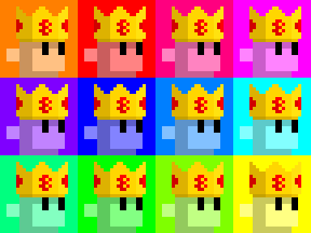
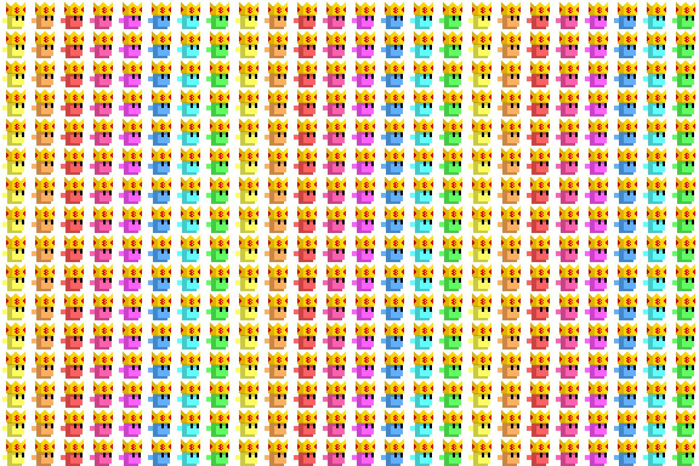
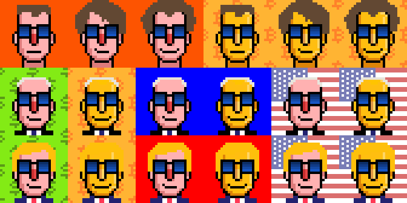

# Pixel Art Sandbox

## Node Shrooms

The world's 1st generative node shrooms (in 24px)!  
the "Sovereign Individual" base types in 4x  (original inscription no. 715 estimated at $20 000 to 30 000) - a first try / sample. 

and a pop art ("more is more") tableau in 2x

# Choose Rich 

The choose rich meme incl. O.G. Nick (O'Neill), Joe (Biden) 
and Donald (Trump). 

# Questions? Comments?

Post them over at the [Help & Support](https://github.com/geraldb/help) page. Thanks.

For all things programming / designing / painting punk (pixel) art join us in the [**Punk Art discord (chat server)**](https://discord.gg/FE3HeXNKRa). 

For all things Ordgen / ORC-721 (bitcoin ordinal generative inscriptions) join us in the [**Ordgen / ORC-721 discord (chat server)**](https://discord.gg/dDhvHKjm2t).

